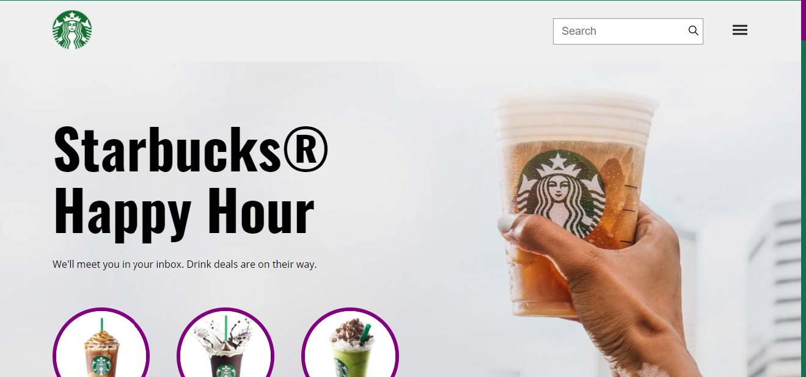

 
  

  &#xa0;

  <!-- <a href="https://starbuckclone.netlify.com">Demo</a> -->

<h1 align="center">StarbuckClone</h1>

  

  

  

  

  

 -- status 

<h4 align="center"> 
	🚧  starbuckclone 🚀 em construção...  🚧
</h4> 

 

  <a href="#dart-sobre">Sobre</a> &#xa0; | &#xa0; 
  <a href="#rocket-tecnologias">Tecnologias</a> &#xa0; | &#xa0;
 
  <a href="https://github.com/Gabriel4420" target="_blank">Autor</a>

 

## :dart: Sobre ##

Clone de interface da escola de webdesign e programação b7web.

## :rocket: Tecnologias ##

As seguintes ferramentas foram usadas na construção do projeto:

- [HTML5](https://alunos.b7web.com.br/curso/html5-e-css3/o-que-e-html-e-pra-que-serve)
- [CSS3](https://alunos.b7web.com.br/curso/html5-e-css3/o-que-e-html-e-pra-que-serve)

Feito com :heart: por <a href="https://github.com/Gabriel4420" target="_blank">Gabriel Rodrigues Perez</a>

&#xa0;

<a href="#top">Voltar para o topo</a>
